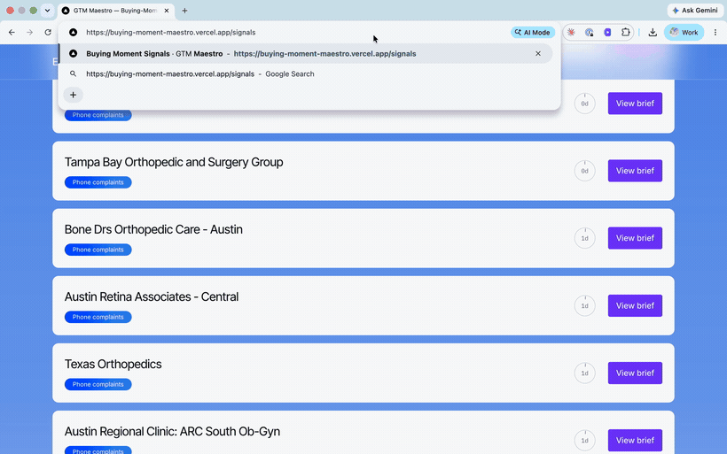
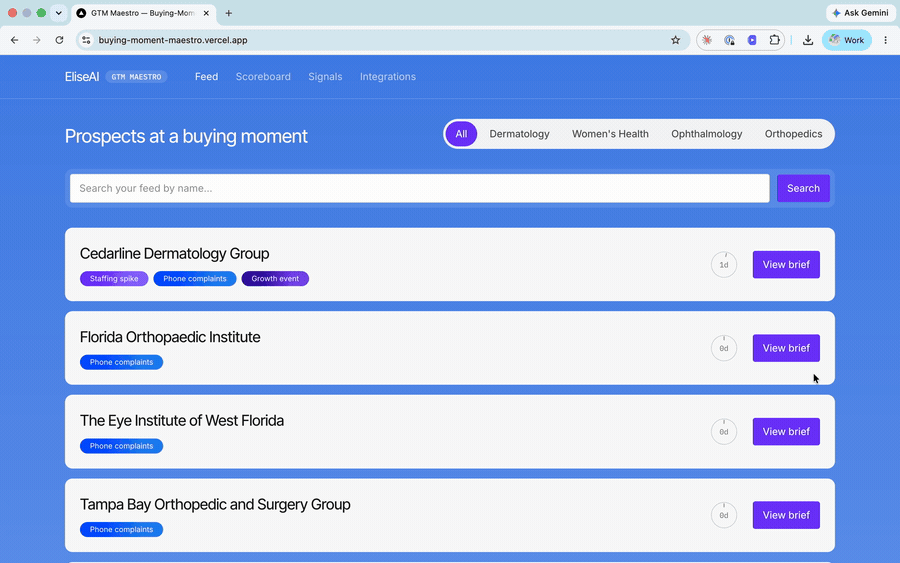
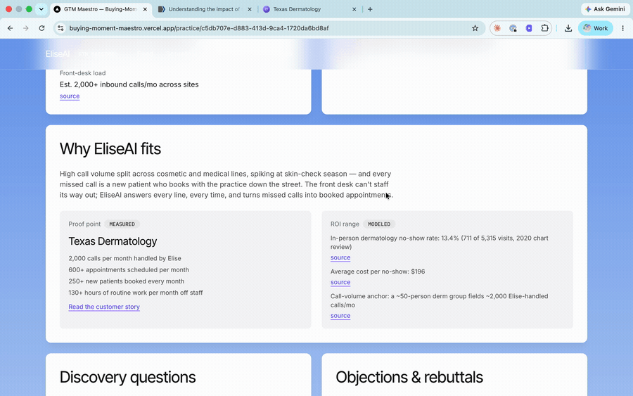
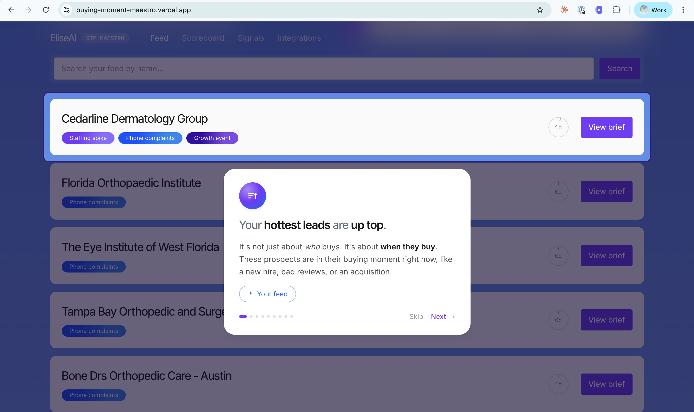
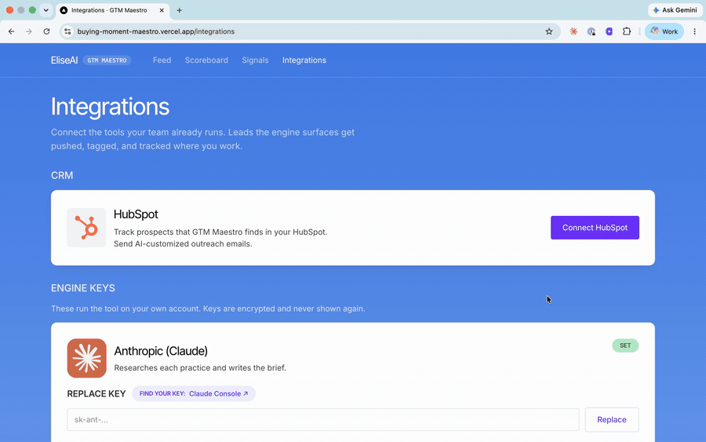
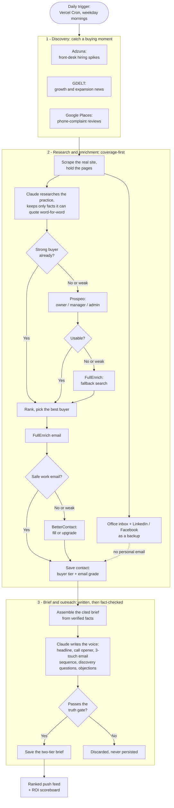

# GTM Maestro: the Buying-Moment Engine

GTM Maestro catches companies the day they tip into ready to buy what you sell, then hands your reps everything they need to close the deal: a researched call brief, the exact buying signal, the decision maker's contact, and the first email sequence.

Every lead tool sorts companies by who they are: their industry, their headcount, their tech stack. But no one buys because they fit a category. They buy the moment a need strikes: a tool breaks, a new leader lands, or they outgrow what they had. GTM Maestro maps your product's real buying moments, then watches multiple public sources around the clock to catch companies the instant they hit one, so you reach out first, while the need is still fresh.



---

## The user story it is built around

The whole thing is built around one rep's wish:

> As an account executive, I want to be handed a steady stream of prospects
> that are hitting a buying moment right now, each with a research-backed, personalized brief, so I can
> get on a call or send outreach already informed, without spending my time researching.

The feed hands them a queue of real practices that just hit a buying moment, and each one shows up with the
brief already written and facts cited.


*The push feed: real named practices at a buying moment, ranked so the hottest rise to the top.*

---

## The thesis: the sale is all about timing.
Most outbound starts from a list of companies that fit a profile, then blasts them. It mostly gets
ignored, because fitting a profile is not the same as being ready to buy. A lot of buying comes down
to timing. A need shows up, and there is a short window. Be the first company to catch that window and 
more people say yes.

So the engine watches for the trigger event: the public signs that a prospect is about to
need help. For an AI platform that supports with key operations, a few buying moment signals we can pull from include:

- They are hiring for the front desk. A rush to hire patient coordinators or call-center staff
  usually means they cannot keep up with the phones, which is exactly the opening.
- Patients are complaining they cannot get through. Reviews that say "on hold forever" or "no one
  answers" are people reporting the phone problem themselves.
- They just grew. An acquisition, a new location, or new doctors means more patients than the front
  desk was built to handle.

Multi-signal Scoring for Prospects:
When a practice shows up on one signal, the engine turns around and checks the others for that same
clinic: is it also hiring front-desk staff, also in the news for a new location or an acquisition,
also collecting reviews about no one answering the phone? Any signal that fires and can be cited gets
stacked onto that practice, so a lead that first came in on reviews can grow into a two- or
three-signal lead. The engine only stacks a signal when the name and location match the practice it
already has, so a similarly named but different clinic never gets folded in by mistake. These checks
only run for practices that already qualified, and every paid lookup gets logged with its cost, so
the cross-checking stays cost-effective. 

The feed ranks practices by how many different fresh signals are firing, using freshness to break
ties. A practice with three live triggers sits above one with a single fading trigger, so the rep
always works the strongest accounts first. The full list of what the engine detects today, what is
built but parked, and where the signal layer is headed lives in
[`docs/signal-catalog.md`](docs/signal-catalog.md). The deeper, code-level guide to the signal system
is in [`docs/data-signal-system.md`](docs/data-signal-system.md).

---

## The full workflow

This is a full go-to-market engine, not just a research helper. This system: 
- finds prospects based on key buying moment signals, like an acquisition or new hire posting that your software can support,
- drafts a customized email sequence, 
- prepares a sales call brief with citations for the Account Executive to save time on research,
- sends email sequence and tracks touchpoints with Hubspot CRM integration
- measures the meetings booked and deals won from these prospects to measure and optimize ROI. 

---

## What's in a prospect brief, and why you can trust it

Every prospect comes with a ready-to-use sales cheat sheet.

- Send email is the "act now" side. It gives you a customized three-message email sequence you can edit in your own words before it goes out.

- Prep for call is the "get ready" side. It's the whole picture of the practice, the proof point and the ROI numbers, a few discovery questions to ask, and the top objections you'll hear with the rebuttals already written.

Every fact in a brief is underlined and linked to the exact source
it came from, and that link is checked before the brief is ever saved. This is the hard part, and it
genuinely works this way:

- While the engine gathers facts, it keeps a fact only if the exact words show up on the page it
  actually read. Anything it cannot match word for word gets dropped, not guessed at.
- Before a brief is saved, it has to pass three checks: is it shaped right, does every claim have a
  citation, and is each claim actually backed by its source. A brief whose claims cannot be traced to
  a source is not saved at all.
- Each citation jumps you to the exact sentence on the source page, so a rep can confirm any line in
  a second instead of taking the tool's word for it.

That is what lets a rep act on a brief without double-checking it. The whole promise is that the rep
can trust it, so they don't waste time questioning the results of under-engineered research prompts dropped into AI. 


*A brief with a citation opened. Every fact links to its source, checked word-for-word before the brief was saved.*

---

## The ROI scoreboard: what you measure improves. 

Every business has two goals: close more deals, and spend less to win each one. Those are the two numbers this tool is judged on. You can't steer by them directly, though, because they only show up later, after a deal is won or lost. So the scoreboard is built the way any operator would build it. The two end goals sit up top, and underneath them are the early signs that move them, each one tied to a decision it lets you make.

The two end goals (lagging metrics):
- Deals won. Are we closing more?
- Cost to win a customer (CAC). Does each new customer cost less?

The leading metrics that give data to guide optimizations that ultimately increase revenue and decrease CAC.
| The metric | The question it answers | The move it lets you make |
|---|---|---|
| Per-signal conversion rate | Which buying signals turn into meetings? | Keep the signals that pay off, kill the ones that do not, and re-rank the feed around them |
| Win rate, cost per meeting, and cycle time, by specialty | Which specialties win fastest and cheapest? | Put reps and budget on the specialties that convert, and rework the pitch for the ones falling behind |
| Messages to land a meeting | How many messages does it take to land a meeting? | Fix the sequences that are not landing |
| Cost per meeting | What does each booked meeting cost? | Put budget where meetings are cheapest |
| Lead-quality feedback, thumbs up or down | Did the AE mark the lead good or not? | Learn what a good lead looks like, so the engine finds more and wastes less |

Metrics per customer segment:
Every number is viewable for the whole book of business or one specialty at a time, so you can see which vertical is carrying the result.
  
The full math behind every number is in [`docs/scoreboard-metrics.md`](docs/scoreboard-metrics.md).


*The scoreboard. Every number carries a measured or modeled tag, and an empty metric shows a dash instead of a fake number.*

---

## Onboarding: walks you through the need-to-know features:


*The guided tour: a branded step card (glowing orb, one-word instruction, context chip) over the real feed.*

### Connecting your tools

The only setup anyone (typically the RevOps leader) actually does lives on the Connections page (`/integrations`).
There are three integrations:

- HubSpot: one secure click (OAuth, so no passwords get shared). That single connection turns on
  three things at once: it pushes and tags the tool's leads into the CRM, sends the approved outreach
  through the rep's own inbox, and pulls in the open, click, and reply tracking that rides along with
  the send. One connection feeds one clean stream of data into the scoreboard, instead of duct-taping
  three tools together.
- Anthropic and People Data Labs: paste your own key for each, and each is encrypted where it is
  stored. These power the prospect enrichment, verification, research, and brief writing.

Until a company connects its own accounts, the whole tool runs on the builder's demo keys (except for hubspot), so someone
evaluating it sees the full value first and gets new leads daily for a week. Connecting flips two features on. 

(1) Emails can be sent and tracked through a company's CRM. 

(2) AI-driven research and brief-writing continues beyond week one trial. Once the Anthropic key is connected, API calls now bill to the
company's own account, so it shows up as real, measured cost in the scoreboard's CAC. 

Step-by-step is in [`docs/revops-connections-guide.md`](docs/revops-connections-guide.md).


*The Connections page (`/integrations`): one secure click for HubSpot, two pasted keys for the engine. The only setup anyone does.*

---

## How it works (architecture)

The engine runs in three stages. It watches public data for a buying moment (discovery: Adzuna for
front-desk hiring spikes, GDELT for growth news, Google Places for phone-complaint reviews),
researches each practice and finds a real contact (the enrichment waterfall, below), then writes the
cited two-tier brief and ranks it into the push feed and the ROI scoreboard (synthesis).

The diagram below is the whole engine, from the daily trigger to the ranked feed. The middle stage,
enrichment, is coverage-first: it aims for a real, reachable contact at as many practices as possible,
doing the cheap step first and only paying for the next one when it has to.


*Google Places phone complaints are live through the discovery path, and the standalone per-place
review reader is also there for targeted cross-checks when a place's ID is already known.*

- **Stack:** Next.js (a customized build; see `AGENTS.md`) and TypeScript, Postgres on Supabase
  through Drizzle, Anthropic Claude for research and brief synthesis (Opus 4.8 for the outreach voice,
  Sonnet 5 and Haiku 4.5 for extraction), a Prospeo, FullEnrich, then BetterContact provider waterfall
  for contact data, and HubSpot for CRM, send, and email analytics behind a single OAuth grant.
- **Contact quality labels:** every contact the engine saves carries two honesty labels. A buyer tier
  ranks how senior the person is, from A (owner or CEO) down to E (a clinician who is not an owner),
  with a separate reachable-fallback tier for someone who is not the decision-maker but still gives the
  rep a way in. An email grade rates how much to trust the address, from a verified work email, down
  through a likely-but-unconfirmed one, a personal address, or a generic office inbox, to none. One rule
  keeps those grades honest: when a provider returns an email it only calls "high probability," the
  engine records it as weak, not safe, until a second provider confirms it. And because the engine works
  cheapest-first, a practice whose own website already names a decision-maker never triggers a paid
  contact search.
- **Data layer:** a normalized Postgres schema is the system of record, with provenance on every fact
  (its source URL plus the timestamp it was detected). Ingestion is idempotent, with upserts guarded by
  `ON CONFLICT` and existence checks so re-runs neither duplicate nor overwrite real rows; raw scraped
  input is kept separate from derived scores; row-level security is enforced on every table; and
  vertical, signal-source, and lead-quality are first-class tag columns, which is what makes the
  per-specialty scoreboard slices exact rather than estimated.
- **Brief synthesis:** two stages. The factual tier (practice profile, incumbent tooling, proof point,
  ROI range, contact) is assembled deterministically from the verified evidence rows. The voice tier
  (headline, call opener, the editable 3-touch sequence, discovery questions, objections) is the only
  text the model writes, and each of its claims must reference an evidence ID present in its own input.
  A brief clears three gates before it persists: schema shape, citation closure, and a numeric-grounding
  lint. One whose claims cannot be grounded is discarded, not stored.
- **Send:** the rep-edited subject and body are written to per-contact HubSpot custom properties, and
  the contact is enrolled in a Sequence whose email template is just those two personalization tokens
  and nothing else, so the message sends from the rep's own mailbox with native open, click, and reply
  tracking while shipping the exact edited text. HubSpot has no API to create a Sequence, so the
  one-time setup is driven by a Claude prompt run in the Chrome extension: it builds the custom
  properties and the Sequence in the HubSpot UI and returns the sequence ID to paste on the Connections
  page. One OAuth grant then covers CRM writes, send, and analytics; per-tenant tokens and pasted keys
  are encrypted at rest with AES-256-GCM.
- **Cost metering:** every paid call (Claude, the contact providers, the detectors) is recorded at the
  call site into a `cost_events` table with its provider, operation, and USD cost, so the scoreboard's
  CAC is derived from metered spend rather than a manual tally.
- **Scheduling:** a Vercel Cron job (`0 8 * * 1-5`) fires the whole engine on weekday mornings. It is
  merged but stays inert until `CRON_SECRET` is set in the deployment (fail-closed), and its reliability
  comes from the run being idempotent, bounded, and reconciliation-based rather than from the scheduler,
  which neither retries nor alerts.

---

## Where this goes next

Everything above is built. Here is where the engine is headed, in priority order, starting with the biggest.

**The full-lifecycle learning loop** is the top priority and the biggest elevation on the list. Today the engine learns from public signals and the AE's thumbs up or down. The next step closes the loop with what actually happens on the sales call. Call recordings flow back into the system, and what was said (the objections that came up, the words that landed, the reasons a deal stalled or closed) feeds forward into the next brief, the next outreach message, and even the buying signals themselves. The engine stops leaning on public data alone and starts learning from real conversations, so every call makes the next one sharper. This is what turns a lead engine into a compounding one.

**A mega-database of buying signals** is next. Today the engine reads three (front-desk hiring, phone-complaint reviews, growth events). The roadmap is a much larger library to pull from, so the engine can catch a buying moment from many more angles and rank on far richer evidence. More signals means more real moments caught, and a feed a competitor cannot easily copy.

**A marketing suite** would warm the lead before sales ever calls. Once the engine spots a practice in a buying moment, marketing can go first. Using AI-generated and Claude-edited video plus hyper-targeted Meta ad campaigns, the company puts a few branded touches in front of that exact practice before any sales email or call arrives. By the time the AE reaches out, the prospect already thinks "I've heard of you." Same buying moment, but the first sales touch lands on a warm name instead of a cold one.

**Brand voice settings** would let each team shape how the drafted emails sound: tone, style, and wording, set once. The AEs and the marketing team teach the engine their voice, so the drafts come out closer to send-ready and there is far less editing per message. Faster sends, and every message still sounds like the team wrote it.

---

## Getting started

You'll need Node 20+, pnpm, and a Postgres database (Supabase).

```bash
pnpm install
cp .env.example .env.local     # fill in the keys named there
pnpm db:migrate                # apply the schema
pnpm db:seed                   # optional: seed a demo dataset
pnpm dev                       # http://localhost:3000
```

Every page renders on a fresh clone even without any keys, using the designed empty and all-zero
states, so you can walk through the whole app first. To run the engine against real data (find
practices, enrich them, write briefs):

```bash
pnpm pipeline                  # supports --dry-run and --limit N
```

Other commands: `pnpm test` (over 900 automated tests across 84 files, covering the engine, brief
writing, the data layer, and the send path), `pnpm typecheck`, `pnpm build`.

Keys: `.env.example` lists every key the project uses and what it is for. The engine needs an
Anthropic key (for the research and the brief writing voice) and, ideally, a PDL key (for verified
contacts). HubSpot is an OAuth connect, and you only need it for live send and CRM tracking.
Everything else runs without it.

> A note on this app's Next.js: this project runs a modified build of Next.js. Read `AGENTS.md`
> before touching framework code.

---

## Docs

- [`docs/spec.md`](docs/spec.md) - the full product spec: the user story, the decision log (D1-D15), the signal catalog, and the locked stack
- [`docs/signal-catalog.md`](docs/signal-catalog.md) - every buying signal: built, parked, and the roadmap
- [`docs/data-signal-system.md`](docs/data-signal-system.md) - how the live signal engine fetches, classifies, resolves, de-dupes, meters, and ranks signals
- [`docs/test-runs/2026-07-13-enrichment-elevation.md`](docs/test-runs/2026-07-13-enrichment-elevation.md) - the test record behind the coverage-first enrichment waterfall: the provider bakeoffs, the real numbers, and why Prospeo goes first
- [`docs/scoreboard-metrics.md`](docs/scoreboard-metrics.md) - the exact math and honesty tag behind every scoreboard number
- [`docs/revops-connections-guide.md`](docs/revops-connections-guide.md) - the one-time admin setup (OAuth plus keys)
- [`docs/hubspot-send-setup.md`](docs/hubspot-send-setup.md) - the HubSpot send configuration
- [`docs/adapt-to-proptech.md`](docs/adapt-to-proptech.md) - how the same engine adapts to a new industry
- [`docs/loom-walkthrough-outline.md`](docs/loom-walkthrough-outline.md) - the walkthrough script (product tour plus rollout)
