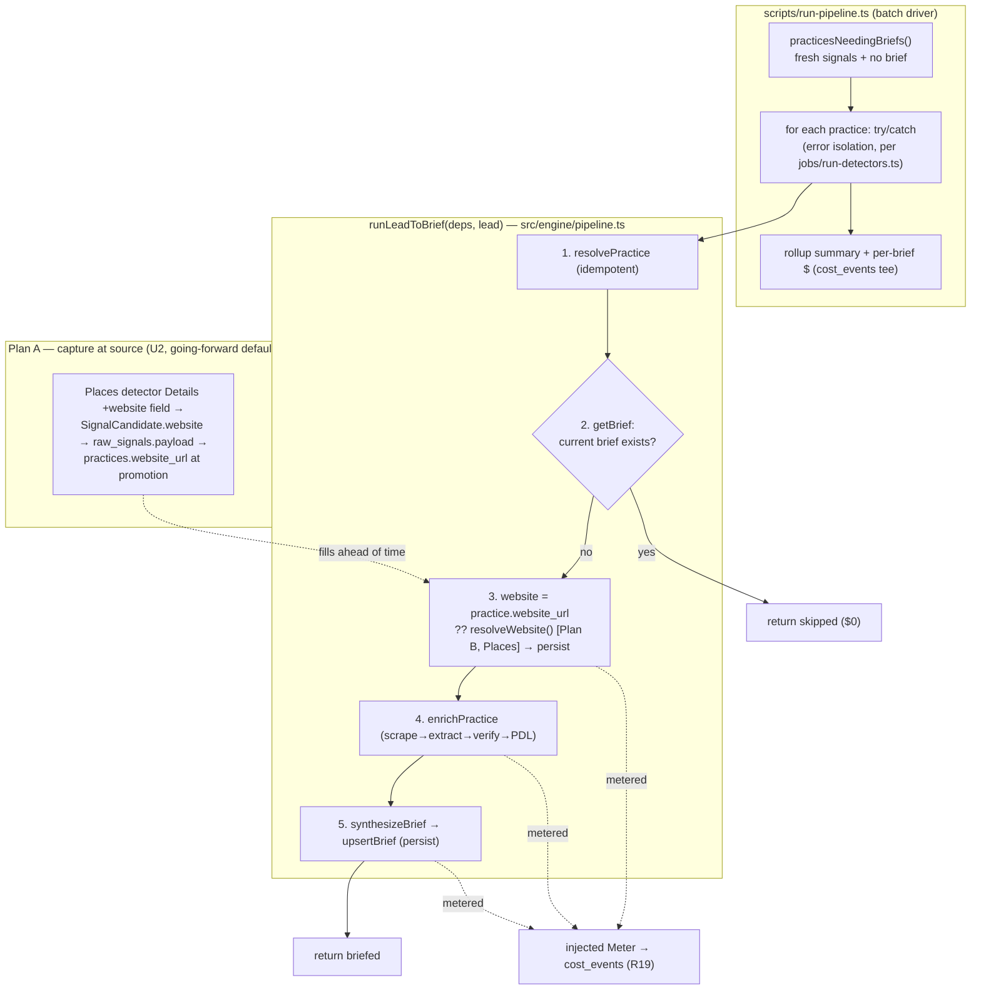

# feat: The lead → brief CONDUCTOR (+ website sourcing that makes the brief good)

## Summary

Every pipeline stage is already built and tested — `resolvePractice`, `enrichPractice`, `synthesizeBrief`/`upsertBrief`, the cost meter — but **nothing chains them**. `enrichPractice` and `synthesizeBrief` have zero callers outside their own module + tests; briefs today exist only via direct seed insert (2 rows in the live DB, both seeded). This plan builds the missing **conductor** (`resolve → enrich → synthesize+persist`, idempotent, cost-metered, error-isolated) and a **runnable seeding script** that pulls the 22 real practices with fired signals but no brief and runs each through it — finally producing real briefs for the feed (U15).

It also closes a quality gap surfaced during scoping and **directed by Lilly**: enrichment needs a practice's **website** to read (scrape → extract firmographics + decision-maker), and today **no website is stored anywhere** (verified: 0 `website` facts, no `practices.website_url`, discovery stores only `place_id`). Without a website the brief degrades to signals + pack only. So this plan adds tiered website sourcing — **"if the lead source hands us a website, keep it; otherwise deliberately search Google for one"** — which lets briefs come out both **good and cheap** (~$0.09/brief on the free-scrape path) instead of relying on the $1.27 agentic fallback.

**This is a deliberate expansion beyond the original "build the bridge, not the stages" task.** It touches the detection→ingest rail (website capture) because brief quality depends on it and Lilly explicitly directed sourcing the website at the cheapest authoritative point (Google Places, a call we already pay for). The single-practice pull-mode API route remains **out of scope** (noted as next).

---

## Problem Frame

**User Story ① (the anchor):** an EliseAI AE is handed a constant flow of practices at a buying moment, each with a verified, ready-to-use brief. The stages that produce that brief exist; the wire-up that turns a found lead into a saved, cited brief does not. This plan is that wire-up.

**Verified current state (origin/main @ 515e673, source of truth):**
- Stages exist, none chained. `enrichPractice`/`synthesizeBrief` have no production callers.
- `synthesizeBrief` already calls `upsertBrief` internally → synth+persist is one call; it fails **free** at its input gate (no Opus spend) for unclassified/zero-signal practices.
- `enrichPractice` never throws on a soft failure (returns `status:"failed"`); with no website it returns `thin-scrape` and makes **$0** in paid calls.
- The model to copy — `scripts/experiment-1-waterfall-split.ts` — already chains `resolvePractice → runCohortEntry(clients)`; the conductor is that head plus an `enrich → synthesize+persist` tail.
- Live DB: 29 practices, **22 with fresh signals + no brief** (the seed target), 2 briefs, **0 stored websites**, most vertical-classified. Google Places key is **live**.
- Website is only ever *passed into* enrichment; the Places Details call the phone-complaints detector already pays for requests `fields=place_id,name,url,reviews` — `url` is the Maps link, **not** the practice's homepage (`website`), which the same call can return.

---

## Requirements

Traceability to the origin build plan (`build-plan.md`) and spec (`eliseai-spec.md`):

- **R-C1 (conductor).** One reusable `runLeadToBrief(deps, lead)` chains `resolve → enrich → synthesize+persist` and returns a structured result summary. Deps (db, one meter, all clients, website resolver) are **injected — no hidden globals** — so it unit/integration-tests cleanly. (origin: BUILD §1; U5/U6)
- **R-C2 (seeding script).** A runnable `scripts/run-pipeline.ts` (npm-wired) pulls practices with fired (fresh) signals but no brief and runs each through the conductor, with `--dry-run` + `--limit` for cost discipline and a rollup summary incl. real $/brief. (origin: BUILD §2; U15)
- **R17 / D13 (idempotent + non-destructive).** A practice with a current brief is **skipped** (no spend); re-running produces **no dupes** and never clobbers a real practice. Respects "briefs persist; regenerate only when signals change." (origin: R17)
- **R19 (cost meter).** Every paid call (Places website lookup, Claude extract, PDL, Opus synth) flows through the injected meter into `cost_events`; a brief's spend lands there. (origin: R19)
- **R9 (enrichment waterfall).** Reuse the built waterfall verbatim; the conductor supplies the website it needs. (origin: R9)
- **R5 / D2 (citation closure).** Reuse the built synthesizer's citation-closure enforcement verbatim; every claim stays cited. (origin: R5)
- **D9 (safety).** Enrich/synthesize only — nothing sends, no PHI, business data only. Website is a business fact. (origin: D9)
- **Error isolation.** One stage failing on one practice is logged and skipped; it never kills the batch — mirroring `jobs/run-detectors.ts`. (origin: BUILD non-negotiables)
- **R-W1 (website sourcing — source-first).** When a lead source provides a website (Google Places `website` field on the call already made), it flows into `practices.website_url` **as the lead is found** — the default. (Lilly-directed, 2026-07-09)
- **R-W2 (website sourcing — deliberate search fallback).** When a practice has no `website_url`, the conductor looks one up by name via Google Places and persists it, before enriching — which also **retroactively fills the existing 22 practices** on the first seeding run. (Lilly-directed, 2026-07-09)

---

## Key Technical Decisions

- **The conductor makes no direct paid call; it threads one injected `Meter`.** Each stage already meters its own paid calls at the call site (`runExtract`, `runPdlPersonEnrich`, `runVoice`, and the new website lookup). The conductor creates nothing global — it receives `db`, `meter`, and clients, and passes them into `WaterfallDeps` / `SynthesizeDeps`. The seeding script builds one `createMeter(teeRecorder(drizzleCostRecorder(db), sink))` so it can attribute per-practice spend from `sink` by `practiceId` (reusing `teeRecorder` + `spendFor`). (Pattern: `src/enrich/experiment-run.ts`.)
- **The conductor always runs the idempotent `resolvePractice` as stage 1.** Faithful to "lead → resolve → …" and reusable for the future pull-mode route. For the seeding path the lead carries the practice's stored `(name, geoKey, city, state)`, so resolve self-matches (similarity 1.0) and returns the same id — idempotent, no dupe, no clobber (`upsertPractice` is `ON CONFLICT DO NOTHING`; a merge never rewrites the surviving name).
- **Idempotency skip is a `getBrief` guard after resolve, before enrich.** If a current brief exists → return `skipped`, spend nothing. `unreadable` (corrupt JSON) is treated as *not current* → regenerate (loud log); `upsertBrief`'s `ON CONFLICT DO UPDATE` fixes it. A `force` flag bypasses the skip for deliberate regeneration. Two layers: the seeding query also pre-filters no-brief practices.
- **Enrich failure is non-fatal to the pipeline.** `enrichPractice` returning `status:"failed"` (e.g. thin scrape) is recorded in the result but the conductor still calls `synthesizeBrief`, which self-guards: it fails *free* at the input gate if the practice is unbriefable, or produces a valid signal+pack brief if classified. Only a hard throw (DB down) propagates — caught by the seeding script's per-practice try/catch (error isolation).
- **Website sourcing is tiered "source-first, search as Plan B".** (a) **Plan A** — the Places detector's Details call adds `website` to its field mask (~$0, same paid call) and threads it via `SignalCandidate.website → raw_signals.payload → practices.website_url` at ingest promotion; captured as the lead is found, never clobbering an existing value. (b) **Plan B** — a small `resolvePracticeWebsite(name, city, state)` does a Google Places text-search→details lookup (reusing built `src/discovery/places-search.ts`, metered R19); the conductor calls it (injected) whenever `website_url` is null, persists the result, and enriches. Plan B doubles as the retroactive backfill for the existing 22 and the runtime fallback. (c) The $1.27 **agentic escalation stays OFF** — cheap real websites make it unnecessary.
- **`practices.website_url` is a nullable input-hint column, not a cited brief fact.** It seeds the scrape; the brief's *cited* `website` fact still comes from enrichment's verified extraction (D2 unaffected). Kept off `practice_facts` (which requires evidence/provenance for brief claims) to avoid conflicting with the extractor's `website` fact on the `(practice, field)` unique key.
- **The website resolver injects into the conductor as `resolveWebsite?`.** Conductor stays testable (fake resolver in tests); the real Places-backed resolver is wired only in the seeding script. Absent/null → enrich proceeds website-less (honest degradation).

---

## High-Level Technical Design

Data flows one direction: a lead resolves to a practice, the practice gets a website (kept from source, or searched), enrichment reads the site, the synthesizer writes a cited brief, and it persists. Two idempotency guards (query pre-filter + `getBrief` skip) and one error-isolation boundary (per-practice try/catch) protect a re-runnable, cost-disciplined batch.

---

## Implementation Units

### U1. `practices.website_url` column + idempotent write

- **Goal:** a single nullable home for a practice's website (the scrape seed), written non-destructively.
- **Requirements:** R-W1, R-W2, R17.
- **Dependencies:** none.
- **Files:** `db/schema/entities.ts` (add `websiteUrl` text, nullable), `db/migrations/NNNN_*.sql` (generated via `npm run db:generate`), `db/ingest.ts` (`UpsertPracticeArgs` gains optional `websiteUrl`; set on insert only), `db/enrich.ts` or a small `setPracticeWebsite(db, id, url)` helper (fill-if-null update for Plan B), `tests/db/website-url.test.ts`.
- **Approach:** add `website_url text` to `practices` (no default, nullable — an input hint, not a cited fact; documented as such next to the `ehr`/`locations_count` removal note). `upsertPractice` accepts `websiteUrl` and sets it **only when creating** (the `ON CONFLICT DO NOTHING` path leaves an existing practice untouched — never clobber). A separate `setPracticeWebsite` does a targeted "update `website_url` only where currently null" for Plan B's fill. Apply the migration to the live Supabase DB.
- **Patterns to follow:** the `practices` table's provenance/removal comment style in `db/schema/entities.ts`; `upsertPractice` in `db/ingest.ts`.
- **Test scenarios:**
  - migration applies cleanly to a fresh PGlite DB; a practice round-trips with `website_url` null by default.
  - `upsertPractice({..., websiteUrl})` on a NEW practice persists the url.
  - `upsertPractice({..., websiteUrl})` on an EXISTING practice (conflict) does **not** overwrite an existing `website_url` (never clobber).
  - `setPracticeWebsite` fills a null `website_url` but leaves a non-null one unchanged.
- **Verification:** `\d practices` shows `website_url`; live migration applied; round-trip test green.

### U2. Plan A — capture the website at the source (Places → practice)

- **Goal:** when a lead source hands us a website, it flows into `practices.website_url` as the lead is found — the going-forward default.
- **Requirements:** R-W1, R19, D9.
- **Dependencies:** U1.
- **Files:** `src/detectors/phone-complaints-google-places.ts` (add `website` to the Details `fields=` mask; capture it into the candidate), `src/engine/detector.ts` (`SignalCandidate` gains optional `website?: string`; `candidateToRawSignals` writes it into the `payload` jsonb), `db/ingest.ts` (promotion reads `payload.website` → `upsertPractice({..., websiteUrl})`), `tests/engine/detector.test.ts` + `tests/db/ingest.test.ts` (extend).
- **Approach:** the Places Details call already runs and is already metered — add `website` to its field mask (ToS-clean: Google bars storing *review text*, not the website). Carry the website on the optional `SignalCandidate.website`, serialize it into `raw_signals.payload` (jsonb already exists — **no new raw_signals column**), and at promotion pass it to `upsertPractice`. Backward-compatible: detectors that don't set `website` change nothing. Other sources (Adzuna/GDELT) that lack a website simply don't set it.
- **Patterns to follow:** `candidateToRawSignals` payload construction in `src/engine/detector.ts`; the promotion `upsertPractice` call in `db/ingest.ts`.
- **Test scenarios:**
  - a `SignalCandidate` with `website` set flows the url through `candidateToRawSignals` into `raw_signals.payload`.
  - ingest promotion of a raw signal whose `payload.website` is set creates the practice with that `website_url`.
  - a candidate with no `website` promotes exactly as before (`website_url` null) — no regression.
  - the Places detector's Details request includes `website` in its `fields=` param (assert against the built URL / recorded fixture).
- **Verification:** an emitted phone-complaints candidate with a website, run through ingest, yields a practice row carrying `website_url`.

### U3. Plan B — deliberate website search (Google Places by name) + meter

- **Goal:** find a website for any practice that has none — the fallback and the retroactive fill for the existing 22.
- **Requirements:** R-W2, R19, D9.
- **Dependencies:** U1.
- **Files:** `src/enrich/website.ts` (`resolvePracticeWebsite(deps, {name, city, state}) → string | null`), `tests/enrich/website.test.ts`.
- **Approach:** reuse `src/discovery/places-search.ts` — text-search `"{name} {city} {state}"` → best `place_id` → Place Details requesting `website` → return the homepage (null if none/ambiguous). Every Places call routes through the injected `meter` (R19; provider `google_places`, operation `website-lookup`). Pure-ish: the Places fetchers are injected so it unit-tests with a fixture and makes zero live calls in CI. Never throws to the caller — a lookup failure returns null (the practice keeps the gap; enrichment degrades honestly).
- **Patterns to follow:** `fetchPlaceDetailsNewest` / text-search in `src/discovery/places-search.ts`; metered-call shape in `src/enrich/pdl.ts`.
- **Test scenarios:**
  - a fixture text-search + details returns the expected `website`, and one `cost_events` row is metered.
  - a no-match text-search returns null and is handled (no throw; metering reflects the actual call made).
  - an ambiguous/empty details response returns null rather than a wrong site.
  - a thrown Places call is caught → returns null, never crashes the caller.
- **Verification:** a live spot-check on 2–3 seed practice names returns their real homepages; `cost_events` shows the lookups.

### U4. `practicesNeedingBriefs` query

- **Goal:** the seeding pull — practices with fired (fresh) signals but no current brief.
- **Requirements:** R-C2, R1 (feed-eligible target), R17.
- **Dependencies:** U1.
- **Files:** `db/queries.ts` (add `practicesNeedingBriefs(db, { now?, limit? })`), `tests/db/queries.test.ts` (extend).
- **Approach:** model on `feedPractices` — join `practices` × `signals`, LEFT JOIN `briefs` filtering `briefs.id IS NULL`, exclude `unclassified` (feed-ineligible → no pack). Group fresh signals in code reusing `isFresh` (the single source of truth — do **not** re-express freshness in SQL). Return `{ id, name, city, state, geoKey, websiteUrl, freshSignalCount }`, ordered by fresh-kind count desc then freshest — so a small `--limit` picks the hottest, most-briefable practices. Include `website_url` so the conductor sees whether Plan B is needed.
- **Patterns to follow:** `feedPractices` grouping + `isFresh` usage in `db/queries.ts`.
- **Test scenarios:**
  - a practice with 2 fresh signals + no brief is returned; one with a brief is excluded.
  - an `unclassified` practice with signals is excluded.
  - a practice whose signals are all expired is excluded (reuses `isFresh`).
  - `limit` caps the result; ordering is fresh-count desc then freshest.
  - `website_url` and `geoKey` are returned for a returned row.
- **Verification:** run against the live DB read-only → returns ~22 practices (matches the probe), ordered hottest-first.

### U5. The conductor — `runLeadToBrief`

- **Goal:** the reusable bridge: resolve → skip-guard → website → enrich → synthesize+persist, returning a summary.
- **Requirements:** R-C1, R17, R19, R9, R5, D9, error isolation.
- **Dependencies:** U1, U3 (injected website resolver).
- **Files:** `src/engine/pipeline.ts` (≤250 lines), `tests/engine/pipeline.test.ts` (unit orchestration), `tests/engine/pipeline.integration.test.ts` (full chain vs. built stages, mocked externals).
- **Execution note:** test-first — write the orchestration unit tests (skip-on-brief, resolve→enrich→synth ordering, meter threading) before the module, then the integration test against the real built stages with `tests/enrich/doubles.ts` + a voice double on PGlite.
- **Approach:** `runLeadToBrief(deps, lead)` where `deps = { db, meter, scrape, extract, pdl, voice, resolveWebsite?, escalation?, now?, logger? }` (all injected) and `lead = { name, geoKey, city?, state?, websiteUrl? }`. Steps: (1) `resolvePractice` → id + `merged`; (2) `getBrief` — if `found` and not `force` → return `skipped`, spend nothing (`unreadable` → regenerate, log loud); (3) website = lead.websiteUrl ?? practice.website_url ?? `deps.resolveWebsite?.(practice)` → `setPracticeWebsite` if newly found; (4) `enrichPractice(waterfallDeps, {id, name, city, state, websiteUrl})` — record result, don't abort on `status:"failed"`; (5) `synthesizeBrief(synthDeps, id)` → returns `generated`/`regenerated`/`failed`. Return a discriminated summary `{ practiceId, practiceName, merged, status: "skipped"|"briefed"|"failed", enrich?, brief?, reason? }`. The conductor itself has no per-stage try/catch — a hard throw propagates to the batch driver's isolation (single responsibility: conductor chains, driver isolates).
- **Patterns to follow:** `scripts/experiment-1-waterfall-split.ts` (resolve→stage chaining, client wiring); `synthesizeBrief`/`enrichPractice` deps shapes.
- **Test scenarios:**
  - **skip:** a practice with a current brief → `skipped`, zero enrich/synth/website calls (spy proves $0).
  - **happy path:** resolve→enrich→synth run in order; a brief persists; summary reports `briefed` with enrich + brief detail.
  - **meter threading:** the one injected meter reaches both enrich and synth call sites (metered rows carry the practiceId).
  - **website fill:** a practice with null `website_url` triggers `resolveWebsite`, persists it, and enrichment receives it; a practice with a stored `website_url` does **not** call `resolveWebsite`.
  - **enrich-failed, brief still attempted:** `enrichPractice` returns `failed` → conductor still calls `synthesizeBrief`; a classified practice with signals still briefs; summary shows `enrich.status:"failed"`.
  - **idempotency:** running the same lead twice produces no duplicate practice and no duplicate brief; second run `skipped`.
  - **unreadable brief:** `getBrief`→`unreadable` regenerates rather than skipping.
  - **force:** `force:true` regenerates even when a brief exists.
  - **Covers R5:** integration test asserts the persisted brief passes `getBrief` (schema-valid) and every voice claim cites an input evidence id (citation closure, via the built synthesizer).
- **Verification:** integration test green against the real built stages with externals mocked; unit tests green.

### U6. The seeding script — `scripts/run-pipeline.ts`

- **Goal:** the runnable batch that finally produces real briefs for the feed, cost-disciplined.
- **Requirements:** R-C2, R17, R19, error isolation.
- **Dependencies:** U4, U5, U3.
- **Files:** `scripts/run-pipeline.ts`, `package.json` (add `"pipeline": "npx tsx scripts/run-pipeline.ts"`), `tests/engine/pipeline-batch.test.ts` (the extractable batch-driver logic — pure, injectable — tested; the CLI wrapper stays thin).
- **Approach:** mirror `scripts/experiment-1-waterfall-split.ts` structure. Parse `--dry-run`, `--limit N` (default small, e.g. 5), `--force`. Validate `REQUIRED_ENV` = `ANTHROPIC_API_KEY, PDL_API_KEY, DATABASE_URL, GOOGLE_PLACES_API_KEY`. `--dry-run`: run `practicesNeedingBriefs`, print count + names, **zero paid calls**. Live: build clients (`anthropicExtractClient`, `pdlClient`, `anthropicVoiceClient`, scraper `(url)=>scrapePractice({fetch},url)`, `resolvePracticeWebsite` bound to live Places), build **one** `createMeter(teeRecorder(drizzleCostRecorder(db), sink))`, loop practices through `runLeadToBrief` inside a per-practice `try/catch` (log + continue — never kill the batch), collect per-practice reports. Print a rollup: N briefed / skipped / failed, total spend, and **per-brief $** computed from `sink` filtered by `practiceId` (`spendFor`). Extract the loop into a pure `runPipelineBatch(deps, practices)` so it's testable without a CLI.
- **Patterns to follow:** `scripts/experiment-1-waterfall-split.ts` (arg parse, dry-run, env gate, resumable loop, summary); `jobs/run-detectors.ts` (per-item try/catch + rollup report); `teeRecorder`/`spendFor` in `src/enrich/experiment-run.ts`.
- **Test scenarios:**
  - `runPipelineBatch` over 3 fake practices returns a rollup with correct briefed/skipped/failed counts.
  - **error isolation:** one practice whose stage throws is logged and skipped; the other two still complete (the throw never propagates out of the batch).
  - per-practice spend is attributed from the tee sink by `practiceId`.
  - `--dry-run` path makes zero paid calls (spy) and prints the pull.
  - a practice already briefed is reported `skipped` with $0.
- **Verification:** `npm run pipeline -- --dry-run` lists the ~22 practices; a live `--limit 3` run produces persisted, schema-valid, fully-cited briefs and prints real per-brief $ (see Verification Plan).

---

## Verification Plan (cost-disciplined, real data)

1. **Green gate:** `npm run typecheck && npm run lint && npm test` all clean; new units' test scenarios implemented and passing.
2. **Dry run:** `npm run pipeline -- --dry-run` → lists ~22 real practices, zero paid calls.
3. **Small real run:** `npm run pipeline -- --limit 3` (or 5) on practices that already have signals. Prove:
   - a persisted `briefs` row exists per practice and is **schema-valid** (`getBrief` → `found`).
   - **citation closure** holds — every voice claim cites an input evidence id (the built synthesizer enforces it; assert on the stored brief).
   - website sourcing worked — `practices.website_url` filled (Plan B) and enrichment read the real site (facts written), OR honest degradation recorded.
   - **`cost_events` rows** show the real spend per brief (Places lookup + extract + synth); report the **$/brief** number.
4. **Report cost before widening.** Present the $/brief and total; do **not** run the full 22 without reporting first.
5. **Idempotency check:** re-run the same `--limit 3` → all `skipped`, no new rows, no new spend.

---

## Scope Boundaries

**In (this PR):** U1–U6 — the conductor, the seeding script, `practicesNeedingBriefs`, and tiered website sourcing (Plan A capture-at-source for Google Places + Plan B deliberate-search fallback/backfill). The small real verification run.

### Deferred to Follow-Up Work (documented, not built)
- **Single-practice pull-mode API route** that reuses this conductor (the on-demand "paste a name" path) — explicitly out of scope; the conductor is built to serve it next.
- **Website capture for non-Places sources** (Adzuna company URL, a name→domain resolver for GDELT-only practices) — Plan B (Places name-search) covers them at runtime for now; source-native capture is the next increment.
- **Regenerate-on-signal-change trigger.** The conductor skips briefed practices and supports `force`; the automated "a signal changed → regenerate" trigger is a separate concern (a future detector-driven job).
- **Agentic escalation ($1.27/practice)** stays wired-but-OFF; unnecessary now that cheap real websites feed the free scrape path.

**Out (not built, not promised):** anything that sends, contacts a practice, or writes PHI (D9); rebuilding any existing stage; the feed/brief UI (already shipped).

---

## Risks & Dependencies

| Risk | Impact | Mitigation |
|------|--------|------------|
| Google Places name-search returns the wrong business | wrong website → wrong firmographics | match on name + city + state; return null on ambiguity rather than a guess; citation-closure still gates the brief (a wrong fact must cite the wrong page, and the AE sees the source link) |
| Places lookup cost creep across a wide run | budget | metered (R19); `--limit` + dry-run; report $/brief before widening; result cached on `practices.website_url` so a re-run never re-pays |
| Existing 22 practices are synthetic/unscrapable | thin briefs even with a website | honest degradation — a signal+pack brief still persists, schema-valid + cited; recorded in the run summary, not hidden |
| Threading `website` through the ingest rail regresses detectors | detection breakage | the field is **optional**; unset behaves exactly as today; covered by extended detector + ingest tests |
| Supabase pooler connection limits during a batch | run aborts mid-batch | reuse one `getDb()` connection; per-practice try/catch isolates a transient; the run is resumable (skip already-briefed) |
| Live keys present only in `.env.local` (gitignored) | CI can't do live calls | externals mocked in CI (per Definition of Done); the one real-call smoke is the manual small run, not CI |

---

## Sources & Research

- `build-plan.md` (origin) — U5/U6/U15 unit definitions, R9/R17/R19, the "briefs persist; regenerate only when signals change" KTD.
- `eliseai-spec.md` — D2 (cited claims), D9 (safety), D13 (immaculate data engineering), § Stack (waterfall, cost meter).
- Source-of-truth code read during scoping: `src/engine/resolver.ts`, `src/enrich/waterfall.ts`, `src/brief/synthesize.ts`, `db/brief.ts`, `src/roi/cost-meter.ts`, `jobs/run-detectors.ts`, `scripts/experiment-1-waterfall-split.ts`, `src/enrich/experiment-run.ts`, `src/discovery/places-search.ts`, `db/schema/entities.ts`, `db/queries.ts`, `db/ingest.ts`, `tests/setup.ts`, `tests/enrich/doubles.ts`.
- Live DB probe (2026-07-09): 29 practices, 22 with signals + no brief, 2 briefs, 0 stored websites, Places key live.
