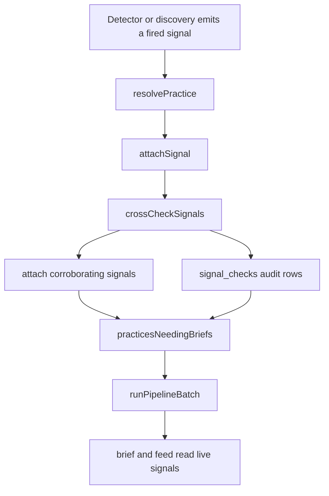
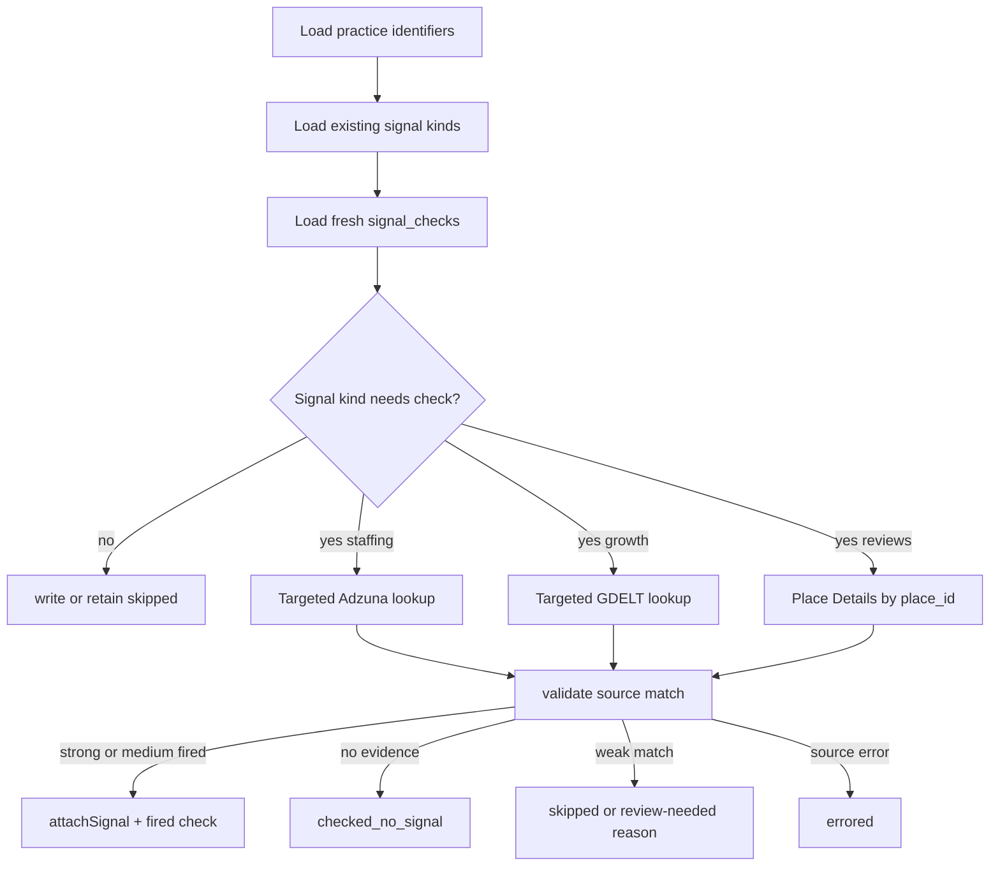

# feat: Add proactive signal cross-checking

## Summary

Add a cross-check stage that starts from an already-found practice and checks the other built signal families for corroborating evidence before briefing. The stage records fired and non-fired checks, attaches only strong or medium matches to the same practice, keeps spend bounded to qualified leads, and proves the Austin feed can surface at least one real 2+ distinct-signal lead.

---

## Problem Frame

The current engine relies on passive detector convergence: staffing, reviews, and growth detectors independently emit candidates, and `resolvePractice` merges them only when `geoKey` matches and name similarity reaches `0.6`. Live runs showed this leaves the timing thesis accidental because a lead found through reviews is not used to investigate staffing or growth evidence for that same clinic, and source-specific naming or geo variants prevent otherwise related signals from stacking.

This plan makes the practice the center of the investigation while preserving the existing detector, resolver, evidence, freshness, feed, and cost-meter spine.

---

## Requirements

**Cross-check orchestration**

- R1. A practice with at least one fresh fired signal is proactively checked against the other built signal kinds after source stages finish and before the brief cohort is selected.
- R2. Cross-checking is bounded to qualified or feed-eligible practices, never every enumerated discovery candidate.
- R3. Each practice-kind check writes an audit row with `fired`, `checked_no_signal`, `errored`, or `skipped`, so absence is distinguishable from never checked.
- R4. Fresh audit rows suppress repeat paid calls until the kind-specific cooldown expires.

**Targeted source behavior**

- R5. Staffing cross-checks query Adzuna by known practice name and metro, including a location parameter instead of relying on a national `what` search.
- R6. Growth cross-checks query GDELT by known practice name plus growth-event phrasing and validate exact practice-name evidence when GDELT geo is too broad.
- R7. Phone-complaints cross-checks use a known Google `place_id` when available and record a skipped audit result when no place identifier is known.

**Match and attach rules**

- R8. Cross-check results auto-attach only when the match is strong or medium; weak matches are skipped or recorded for review, never silently stacked.
- R9. Name matching strips location and direction tails such as city suffixes, pipe-delimited branches, and north/south/central variants without merging genuinely different clinics.
- R10. Geo normalization reconciles source-specific metro variants such as county-shaped keys into the engine's canonical city-state key while avoiding country-only false merges.
- R11. Fired cross-check signals attach through `attachSignal`, carry citations, `detected_at`, freshness expiry, confidence, and a cross-check-specific `signalSource`.

**Safety, cost, and product outcome**

- R12. Every paid cross-check call routes through the existing `cost_events` meter with the resolved `practiceId` attached.
- R13. The implementation stores only public business signal data and does not persist Google review text.
- R14. Re-running cross-checks does not duplicate signal rows, evidence rows for the same source URL, or fresh audit rows.
- R15. Feed ranking continues to use distinct fresh fired signal kinds first, so a real 2+ kind practice outranks single-signal practices.
- R16. A live Austin verification run writes a test-run note showing at least one cited 2+ distinct-signal lead or an honest blocker with cost and source coverage.

---

## High-Level Technical Design

### Cross-check stage position

The stage should run centrally in the engine after source stages finish and before `practicesNeedingBriefs` selects the downstream brief cohort. This keeps cross-checking centered on qualified leads, covers detector and discovery emissions through one integration seam, and lets the brief see the full fired signal set when cross-checks succeed.

### Per-practice cross-check flow

The cross-checker should not invent a signal to satisfy the demo. A clean source miss is a first-class result.

### Match confidence tiers

| Tier | Auto-stack? | Evidence examples |
|---|---:|---|
| Strong | Yes | Same `place_id`, same website/domain, exact normalized name in the same metro, or targeted source result mentions the exact practice name. |
| Medium | Yes | Location-tail-stripped name similarity above threshold plus same canonical metro, or parent employer/article text clearly mentions the clinic. |
| Weak | No | Similar name only, state/country-only geography, or parent brand with no clinic mention. |

---

## Key Technical Decisions

- KTD1. **Make cross-checking a central post-source engine stage, not another discovery detector:** The existing detectors find candidates, while this stage confirms other signal families for known practices after all source stages have landed signals and before briefing starts. This avoids a parallel persistence path and keeps `resolvePractice`, `attachSignal`, freshness, and feed ranking as the source of truth.
- KTD2. **Persist `signal_checks` separately from `signals`:** Fired signals prove buying moments; check rows prove source coverage and suppress repeat spend. Keeping them separate prevents checked-but-empty results from polluting feed ranking.
- KTD3. **Use targeted adapter functions beside discovery-mode detectors:** Adzuna, GDELT, and Places need different query shapes for “find candidates” versus “check this practice.” Adding targeted functions keeps current detector behavior stable.
- KTD4. **Attach only validated strong/medium matches:** Targeted queries reduce ambiguity but do not remove it. Match validation protects against a job post from a parent brand or similarly named clinic becoming a false multi-signal lead.
- KTD5. **Normalize geo and name before lowering thresholds:** The live failures point to location tails and incompatible geo keys, not a bad `0.6` threshold. Keep the threshold defensible and improve canonicalization first.
- KTD6. **Meter cross-check calls with resolved `practiceId`:** Discovery costs are sometimes unattributed because they run before a practice exists; cross-checks run after resolution, so their spend should support per-lead CAC accounting.
- KTD7. **Record empty and skipped checks as product facts:** The UI and audit trail need to distinguish “growth checked and not found” from “growth never checked.” The plan stores the distinction now even if the feed detail view only surfaces fired signals in the first pass.

---

## Scope Boundaries

### In scope

- Add the cross-check stage, targeted source lookups, match validation, audit storage, cooldowns, tests, and Austin live verification.
- Fix name canonicalization and canonical metro handling only where needed for cross-source reconciliation.
- Preserve the current feed ranking rule: distinct fresh fired signal kinds first, freshness as the tiebreak.

### Deferred to Follow-Up Work

- Add a full UI coverage panel showing checked-but-empty signal families on the practice detail page.
- Introduce manual review queues for weak matches if skipped weak matches prove common.
- Add numeric signal-strength scoring beyond existing confidence and distinct-kind count.
- Add new signal families beyond the three built D3 signals.

### Out of scope

- Contacting clinics, sending outreach, or storing patient data.
- Scraping review text outside the current Google Places ToS-safe pattern.
- Replacing the existing detector framework or resolver spine.

---

## Implementation Units

### U1. Add `signal_checks` persistence

- **Goal:** Create an audit/cache table for every attempted practice-kind cross-check.
- **Requirements:** R3, R4, R12, R13, R14.
- **Dependencies:** None.
- **Files:** `db/schema/entities.ts`, `db/schema/index.ts`, `db/migrations/0009_signal_checks.sql`, `db/queries.ts`, `tests/db/migrations.test.ts`, `tests/engine/cross-check.test.ts`.
- **Approach:** Add a `signal_checks` table keyed by practice, signal kind, provider/source, and checked window. Store status, checked timestamp, cost event id or cost fields, matched practice name, match confidence, evidence id, and reason. Keep RLS enabled with no client policy, matching the existing server-mediated schema. Add query helpers for fresh-check lookup and audit writes so orchestration does not hand-roll SQL.
- **Patterns to follow:** `db/schema/discovery.ts` for audit/cache semantics; `db/schema/roi.ts` for cost-related fields; `db/discovery.ts` for upsert-style archive updates.
- **Test scenarios:**
  - Creating a fresh database exposes `signal_checks` through the migrations test.
  - Writing a `checked_no_signal` result for a practice-kind can be read back as fresh within its cooldown.
  - Writing a `fired` result links to the resulting evidence row without requiring a duplicate signal row.
  - Rewriting the same practice-kind/provider within a cooldown updates or returns the same audit record instead of duplicating it.
  - No patient-shaped fields or review-text fields exist in the schema.
- **Verification:** The schema supports fired, no-signal, skipped, and errored outcomes without changing feed signal counts.

### U2. Strengthen name and geo normalization for cross-source matching

- **Goal:** Reconcile cross-source spellings and geo variants without weakening entity separation.
- **Requirements:** R8, R9, R10, R14.
- **Dependencies:** None.
- **Files:** `src/engine/resolver.ts`, `src/discovery/places-search.ts`, `src/detectors/staffing-spike-adzuna.ts`, `src/detectors/growth-events-gdelt.ts`, `tests/engine/resolver.test.ts`, `tests/detectors/staffing-spike-adzuna.test.ts`, `tests/detectors/growth-events-gdelt.test.ts`.
- **Approach:** Extend canonicalization to remove branch/location tails and low-identity direction tokens while preserving brand and specialty tokens. Introduce a shared canonical metro helper for city-state keys, and treat country-level GDELT geography as insufficient for auto-merge unless name evidence is strong. Keep `NAME_MATCH_THRESHOLD` at `0.6` unless tests show the stronger canonicalization still misses true same-practice examples.
- **Patterns to follow:** Existing pure `canonicalizeName`, `nameSimilarity`, `isSameEntity`, and detector normalization tests.
- **Test scenarios:**
  - `Sanova Dermatology` matches `Sanova Dermatology | Austin - North Austin` above threshold.
  - `Sunshine Dermatology` still does not match `Sunrise Dermatology`.
  - Direction and city tokens do not make two different clinics match when the core names differ.
  - Adzuna county-like or display-location variants normalize to the same Austin metro key used by discovery.
  - GDELT country-only geography does not pass a same-geo auto-merge by itself.
- **Verification:** Resolver tests cover the live failure mode and the existing false-positive guard remains green.

### U3. Add targeted source lookup functions

- **Goal:** Give each source a targeted “check this practice” mode without disturbing discovery mode.
- **Requirements:** R5, R6, R7, R12, R13.
- **Dependencies:** U2 for shared geo/name helpers.
- **Files:** `src/detectors/staffing-spike-adzuna.ts`, `src/detectors/growth-events-gdelt.ts`, `src/detectors/phone-complaints-google-places.ts`, `tests/detectors/staffing-spike-adzuna.test.ts`, `tests/detectors/growth-events-gdelt.test.ts`, `tests/detectors/phone-complaints-google-places.test.ts`.
- **Approach:** Add targeted query types and functions for practice-specific checks. Adzuna should include a location parameter in addition to `what`; GDELT should build a practice-name query with growth phrases and bounded records; Places should reuse place-id details. Keep fetchers injected in tests, parse responses through the existing zod schemas, and return normalized candidates plus match hints.
- **Patterns to follow:** Current adapter split between thin live I/O functions and pure normalizers; detector tests with fixtures and injected fetchers.
- **Test scenarios:**
  - Targeted Adzuna URL includes the known practice name and location parameter.
  - A valid front-desk job for the known practice returns a staffing candidate with cited source URL and metro hint.
  - A job with only a parent or weakly similar employer returns a candidate that can be classified weak by U4, not directly attached.
  - Targeted GDELT query includes exact practice name and growth terms.
  - A valid GDELT article that mentions the practice produces cited growth evidence.
  - Places targeted lookup by `place_id` preserves the no-review-text persistence rule.
- **Verification:** All targeted source behavior is testable without live keys.

### U4. Implement match validation and check-result classification

- **Goal:** Classify targeted source results into attachable fired signals, clean misses, errors, and skipped weak matches.
- **Requirements:** R3, R8, R9, R10, R11, R14.
- **Dependencies:** U1, U2, U3.
- **Files:** `src/engine/cross-check.ts`, `tests/engine/cross-check.test.ts`, `src/engine/resolver.ts`.
- **Approach:** Add pure match validation helpers that compare known practice identifiers against source identity hints. Strong and medium results are eligible for `attachSignal`; weak results are audit-only. Treat missing source evidence as `checked_no_signal`, missing prerequisites such as no `place_id` as `skipped`, and thrown source calls as `errored`.
- **Patterns to follow:** Pure resolver helpers and existing `attachSignal` idempotency tests.
- **Test scenarios:**
  - Same `place_id` classifies as strong.
  - Same website/domain classifies as strong when present.
  - Exact cleaned name plus same canonical metro classifies as strong or medium.
  - Location-tail-stripped similarity plus same metro classifies as medium.
  - Similar name with state-only or country-only geography classifies as weak and does not attach.
  - Source error writes an `errored` check result with a reason and no signal.
- **Verification:** Cross-check matching can be reviewed independently of external APIs.

### U5. Build `crossCheckSignals(practiceId)` orchestration

- **Goal:** Run targeted checks for missing or stale signal kinds and attach corroborating signals to the known practice.
- **Requirements:** R1, R2, R3, R4, R7, R11, R12, R13, R14.
- **Dependencies:** U1, U3, U4.
- **Files:** `src/engine/cross-check.ts`, `src/engine/freshness.ts`, `db/queries.ts`, `jobs/run-engine.ts`, `tests/engine/cross-check.test.ts`, `tests/engine/run-engine.test.ts`, `tests/db/queries.test.ts`.
- **Approach:** Load a bounded cohort of practices that have at least one fresh fired signal and need cross-check coverage, then load each practice, current fresh signal kinds, known identifiers, and recent checks. For each missing built signal kind, run the targeted check only if cooldown permits and prerequisites are present. Route every paid call through the injected meter with `practiceId`. Use `attachSignal` for fired strong/medium results and write audit rows for all outcomes. Wire the stage centrally in `runEngine` after detectors and discovery finish and before `practicesNeedingBriefs` pulls the brief cohort; standalone discovery can keep returning qualified places without owning cross-source orchestration.
- **Execution note:** Start with failing orchestration tests that seed one fired signal and prove the other two source checks run.
- **Patterns to follow:** `runEngine` stage isolation, `runDiscovery` cost-meter threading, and `attachSignal` idempotency.
- **Test scenarios:**
  - One fired phone-complaints signal triggers staffing and growth checks, but not a duplicate phone check.
  - A valid targeted Adzuna job attaches `staffing_spike` to the same practice and writes a fired check row.
  - A valid targeted GDELT article attaches `growth_events` to the same practice and writes a fired check row.
  - An empty targeted source writes `checked_no_signal` and does not attach a fake signal.
  - Missing `place_id` for reviews writes `skipped` when the practice came from a non-Places source.
  - Re-running within cooldown makes no new source calls and creates no duplicate signals.
  - A source throw records `errored` while the remaining checks continue.
  - Metered cross-check rows include the resolved `practiceId`.
- **Verification:** Cross-check orchestration is deterministic and idempotent under fake fetchers.

### U6. Preserve feed ranking and brief input behavior

- **Goal:** Ensure cross-checked signals change the product where intended: signal count, ranking, and brief facts.
- **Requirements:** R11, R15.
- **Dependencies:** U5.
- **Files:** `db/queries.ts`, `src/brief/inputs.ts`, `app/feed.tsx`, `app/practice/[id]/page.tsx`, `tests/db/queries.test.ts`, `tests/brief/assemble.test.ts`, `tests/engine/pipeline.integration.test.ts`.
- **Approach:** Keep feed ranking untouched unless tests expose a bug. Add coverage proving cross-check-attached signals are indistinguishable from detector-attached signals for `signalCount`, brief input assembly, and practice detail rendering. Do not render checked-but-empty rows in the feed headline yet.
- **Patterns to follow:** `feedPractices` distinct-kind grouping and existing brief live-signal read from `practiceSignalRows`.
- **Test scenarios:**
  - A practice with cross-checked staffing plus original reviews ranks above a one-signal practice.
  - Two evidence rows of the same kind still count as one fired signal kind.
  - Practice detail shows cross-check-attached fired signals with source, freshness, and confidence.
  - A checked-but-empty signal_check does not increase `signalCount` or produce a brief claim.
- **Verification:** The D8 ranking thesis becomes visible without changing the feed's definition of “fired.”

### U7. Add live Austin verification and run documentation

- **Goal:** Prove the behavior on real data and record cost honestly.
- **Requirements:** R12, R13, R16.
- **Dependencies:** U5, U6.
- **Files:** `scripts/run-pipeline.ts`, `scripts/probe-discovery.ts`, `docs/test-runs/2026-07-12-proactive-signal-cross-check-austin.md`, `README.md`.
- **Approach:** Add or reuse a script path that runs all three signal families plus cross-check on Austin with bounded limits. Report source calls, cost from `cost_events`, fired signal kinds, checked-but-empty counts, skipped counts, and the feed row that achieved 2+ distinct signal kinds. If live data fails to yield a 2+ lead, document the blocker rather than fabricating one.
- **Patterns to follow:** Existing `docs/test-runs/2026-07-10-first-real-pipeline-run.md` and `docs/test-runs/2026-07-11-ship-day-demo-population.md` honesty style.
- **Test scenarios:**
  - Script dry-run or fake-fetcher mode reports source coverage and cost summary without network.
  - Live-run write-up includes at least one Austin practice with cited fired signal kinds, or a clear no-yield blocker.
  - Spend summary reconciles with `cost_events` for the run window.
- **Verification:** A real Austin feed row with 2+ distinct signal kinds exists, cited and freshness-stamped, or the documented blocker is specific enough for follow-up.

---

## Acceptance Examples

- AE1. Given a practice qualified from Google Places reviews in Austin, when `crossCheckSignals` runs, then staffing and growth targeted checks run for that practice and write audit rows for both outcomes.
- AE2. Given the staffing check finds a front-desk Adzuna job whose employer matches the practice with strong or medium confidence, when the result is processed, then `staffing_spike` attaches to the original practice with cited evidence and a fresh timestamp.
- AE3. Given the growth check returns no matching article, when the result is processed, then `checked_no_signal` is recorded and no growth signal appears in the feed or brief.
- AE4. Given a weakly similar employer name in the same state but not the same clinic, when match validation runs, then the result is not auto-stacked.
- AE5. Given a cross-checked practice has two distinct fresh signal kinds, when the feed is queried, then it ranks above comparable one-signal practices.

---

## Risks & Dependencies

- **API shape drift:** Adzuna and Google Places request parameters are externally defined. The implementation should validate against official docs before live verification and keep all source calls behind injected functions.
- **Cost creep:** Cross-checking can multiply calls by lead count. Cooldowns, feed-eligible gating, and per-run caps are required before any broad run.
- **False stacking:** Targeted queries can still return parent brands or similar names. Match validation must bias toward skipping weak matches.
- **Sparse live data:** Austin may not produce a real 2+ signal within a short run. The verification write-up must report source coverage and blockers honestly.
- **Migration safety:** Adding `signal_checks` is additive, but tests must prove migrations apply cleanly and RLS remains deny-by-default.

---

## Documentation / Operational Notes

- Update the README or runbook only where operators need to know how to run the bounded Austin verification and interpret `signal_checks` results.
- The test-run note should include the run window, metro, limits, source call counts, total cost, fired signal-kind counts, no-signal counts, errored/skipped counts, and the exact practice IDs or names used for verification.
- Keep the D9 note explicit: no practice is contacted, no outreach sends, and no review text is stored.

---

## Sources & Research

- `src/engine/resolver.ts` — current name canonicalization, `NAME_MATCH_THRESHOLD = 0.6`, `resolvePractice`, and `attachSignal` idempotency.
- `jobs/run-discovery.ts` and `jobs/run-engine.ts` — current source orchestration, cost-meter threading, and cascade placement.
- `src/detectors/staffing-spike-adzuna.ts`, `src/detectors/growth-events-gdelt.ts`, and `src/detectors/phone-complaints-google-places.ts` — current discovery-mode adapter shapes and pure normalization patterns.
- `db/schema/entities.ts`, `db/schema/discovery.ts`, and `db/schema/roi.ts` — schema patterns for cited signals, discovery audit/cache rows, and cost events.
- `db/queries.ts` — feed ranking by distinct fresh signal kinds.
- `docs/test-runs/2026-07-10-first-real-pipeline-run.md` and `docs/test-runs/2026-07-11-ship-day-demo-population.md` — live evidence for zero multi-signal leads and root-cause notes.
- EliseAI spec decisions D3, D8, D9, and R19 from the planning source: three built signal families, signal-count ranking, real business data only, and metered paid calls.
- Official docs consulted: Adzuna job search API docs (`https://developer.adzuna.com/docs/search`), Google Places Place Details docs (`https://developers.google.com/maps/documentation/places/web-service/place-details`), and GDELT project/API surface docs (`https://www.gdeltproject.org/`, `https://gdelt.github.io/`).
